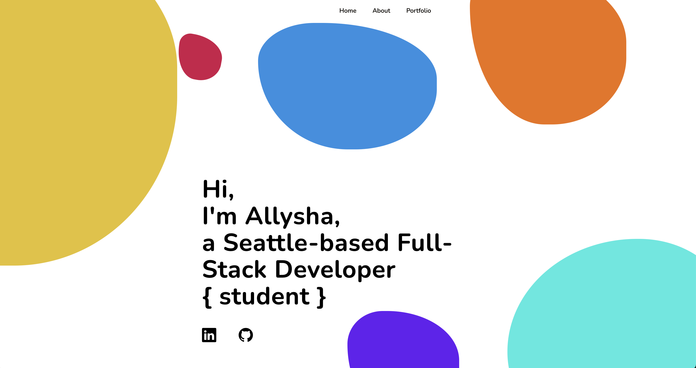

# updatedPortfolio

## Description

* This is my second updated portfolio with links to my updated Linkedin and GitHub accounts. 

* I completely renovated my portfolio page from my initial submission. I wanted to experiment with incorporating animation and motion design, while keeping the style minimalistic with a bold color palette. 

* For the final submission, I need to: add in a biography, and a professional-looking (non-selfie) picture in the 'about' section. I plan on working on the landing page a bit more, as I am finding out I prefer CSS grid > Flexbox and am not satisfied with the way the font is laid out.   

## Core Objectives Met

* Submit an updated portfolio featuring Project 1 and two exemplary homework assignments.

* Submit an updated GitHub profile with pinned repositories featuring Project 1 and two exemplary assignments.

* Submit an updated resume.

* Submit an updated LinkedIn profile.

## Animation & Images

* Click [here](https://drive.google.com/file/d/1irKlzIb7i2jPGobVLLAqWnS-ssDQ1lft/view?usp=sharing) for animation demonstration.

## License

Copyright 2021 Allysha Jovich

Permission is hereby granted, free of charge, to any person obtaining a copy of this software and associated documentation files (the "Software"), to deal in the Software without restriction, including without limitation the rights to use, copy, modify, merge, publish, distribute, sublicense, and/or sell copies of the Software, and to permit persons to whom the Software is furnished to do so, subject to the following conditions:

The above copyright notice and this permission notice shall be included in all copies or substantial portions of the Software.

THE SOFTWARE IS PROVIDED "AS IS", WITHOUT WARRANTY OF ANY KIND, EXPRESS OR IMPLIED, INCLUDING BUT NOT LIMITED TO THE WARRANTIES OF MERCHANTABILITY, FITNESS FOR A PARTICULAR PURPOSE AND NONINFRINGEMENT. IN NO EVENT SHALL THE AUTHORS OR COPYRIGHT HOLDERS BE LIABLE FOR ANY CLAIM, DAMAGES OR OTHER LIABILITY, WHETHER IN AN ACTION OF CONTRACT, TORT OR OTHERWISE, ARISING FROM, OUT OF OR IN CONNECTION WITH THE SOFTWARE OR THE USE OR OTHER DEALINGS IN THE SOFTWARE.

## URL of Deployed Application

* https://ajovich.github.io/updatedPortfolio/

## URL of GitHub Repository

* https://github.com/ajovich/updatedPortfolio
