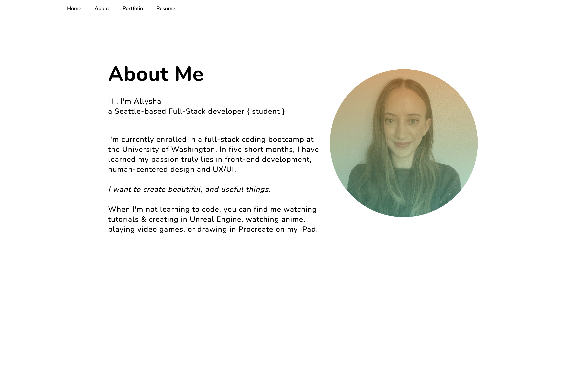

# updatedPortfolio

## Description

* This is my third portfolio update. For this update:

    * I added icons with links to my updated Linkedin, GitHub account, and developer gmail. 

    * I added a link on the navigation with an updated resume.

    * I updated my biography and added a portfolio photo of myself. 

* I completely renovated my portfolio page from my initial submission. I wanted to experiment with incorporating animation and motion design, while keeping the style minimalistic with a bold color palette. 

* I will probably adjust the landing page a bit more from here on out, as I am not satisfied with how the blobs line up on mobile. The hamburger navigation bar also still needs a bit of work. 

## Core Objectives Met

* Updated portfolio featuring at least 3 examples of student work from either deployed projects of homeworks.

* Update GitHub profile with pinned repositories featuring at least 3 examples of student work from either deployed projects of homeworks. Including biography, developer e-mail, and link to deployed portfolio, 2 pinned repositories with README.md and MIT license. 

* Updated resume.

* Updated LinkedIn profile.

## Animation & Images

* Click [here](https://drive.google.com/file/d/1irKlzIb7i2jPGobVLLAqWnS-ssDQ1lft/view?usp=sharing) for animation demonstration (from my second portfolio update)

## License

Copyright 2021 Allysha Jovich

Permission is hereby granted, free of charge, to any person obtaining a copy of this software and associated documentation files (the "Software"), to deal in the Software without restriction, including without limitation the rights to use, copy, modify, merge, publish, distribute, sublicense, and/or sell copies of the Software, and to permit persons to whom the Software is furnished to do so, subject to the following conditions:

The above copyright notice and this permission notice shall be included in all copies or substantial portions of the Software.

THE SOFTWARE IS PROVIDED "AS IS", WITHOUT WARRANTY OF ANY KIND, EXPRESS OR IMPLIED, INCLUDING BUT NOT LIMITED TO THE WARRANTIES OF MERCHANTABILITY, FITNESS FOR A PARTICULAR PURPOSE AND NONINFRINGEMENT. IN NO EVENT SHALL THE AUTHORS OR COPYRIGHT HOLDERS BE LIABLE FOR ANY CLAIM, DAMAGES OR OTHER LIABILITY, WHETHER IN AN ACTION OF CONTRACT, TORT OR OTHERWISE, ARISING FROM, OUT OF OR IN CONNECTION WITH THE SOFTWARE OR THE USE OR OTHER DEALINGS IN THE SOFTWARE.

## URL of Deployed Application

* https://ajovich.github.io/updatedPortfolio/

## URL of GitHub Repository

* https://github.com/ajovich/updatedPortfolio
